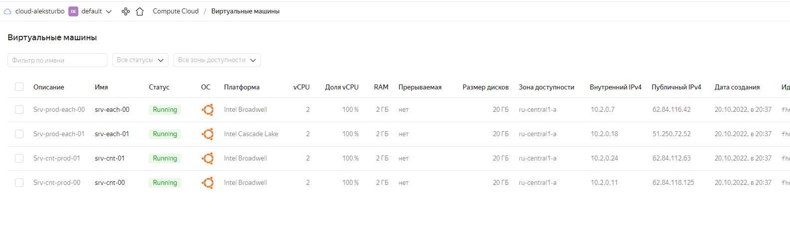

# Домашнее задание к занятию "7.3. Основы и принцип работы Терраформ"

## Задача 1 - бэкэнд в S3

1. Создаем бакет S3:

```bash
aleksturbo@AlksTrbNoute:~$ aws s3api create-bucket --endpoint-url https://storage.yandexcloud.net --bucket aleksturbo --region ru-central1-a --object-ownership BucketOwnerEnforced --create-bucket-configuration LocationConstraint=ru-central1-a
{
    "Location": "/aleksturbo"
}
aleksturbo@AlksTrbNoute:~$ aws s3 ls --endpoint-url https://storage.yandexcloud.net
2022-10-17 21:32:14 aleksturbo
```

2. Подключаем S3:

```tf
backend "s3" {
    endpoint = "storage.yandexcloud.net"
    bucket   = "aleksturbo"
    key      = "terraform.tfstate"
    region   = "ru-central1-a"

    skip_region_validation      = true
    skip_credentials_validation = true
  }
  ```


## Задача 2

1. Подготавливаем terraform:

```bash
aleksturbo@AlksTrbNoute:~/terraform73$ terraform init

Initializing the backend...

Initializing provider plugins...
- Reusing previous version of yandex-cloud/yandex from the dependency lock file
- Using previously-installed yandex-cloud/yandex v0.80.0

Terraform has been successfully initialized!
```

2. Создаем два воркспейса stage и prod:

```bash
aleksturbo@AlksTrbNoute:~/terraform73$ terraform workspace new stage
Created and switched to workspace "stage"!

aleksturbo@AlksTrbNoute:~/terraform73$ terraform workspace new prod
Created and switched to workspace "prod"!

aleksturbo@AlksTrbNoute:~/terraform73$ terraform workspace list
  default
* prod
  stage
```

3.
4.
5.
6.
7.

Подготавливаем манифесты terraform со следующей логикой:
    - количество инстансов зависит от workspace: для prod - 2, для stage-1
    - зависимость типа инстанса от workspace

[terraform files](https://github.com/AleksTurbo/devops-netology/tree/main/terraform/hw73)

Вывод имеющихся workspace:

```bash
aleksturbo@AlksTrbNoute:~/terraform73$ terraform workspace list
  default
* prod
  stage
```



Вывод команды terraform plan для воркспейса prod: [output-tf-plan](https://github.com/AleksTurbo/devops-netology/blob/main/terraform/hw73/output-tf-plan.txt)
