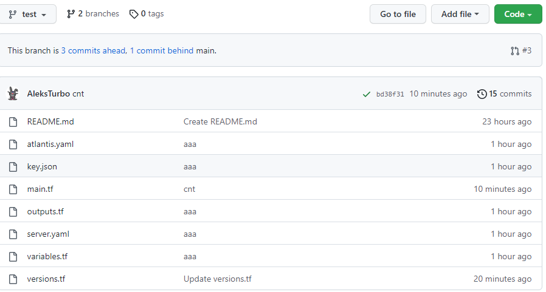
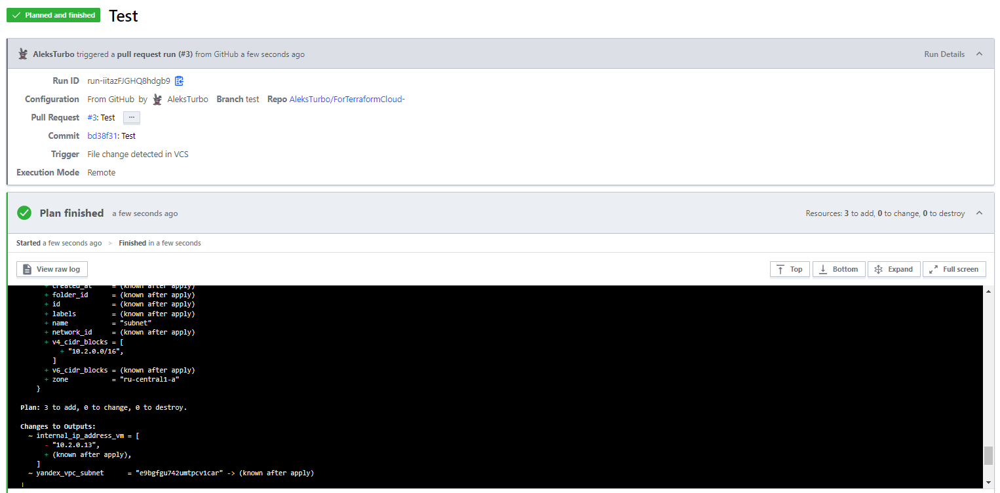

# Домашнее задание к занятию "7.3. Основы и принцип работы Терраформ"

## Задача 1 - Работаем с  terraform cloud:

1. Зарегистрируемся на https://app.terraform.io/ - выполнено
2. Создаем вспомогательный репозиторий: [Files For TerraformCloud](https://github.com/AleksTurbo/ForTerraformCloud-)
3. Подключили репозиторий в terraform.io - готово.
4. Выполняем plan и apply:
  

## Задача 2 - Работаем с ATLANTIS

1. Подготавливаем конфигурационные файлы:
  
  
2. Проверяем функциональность:
  
