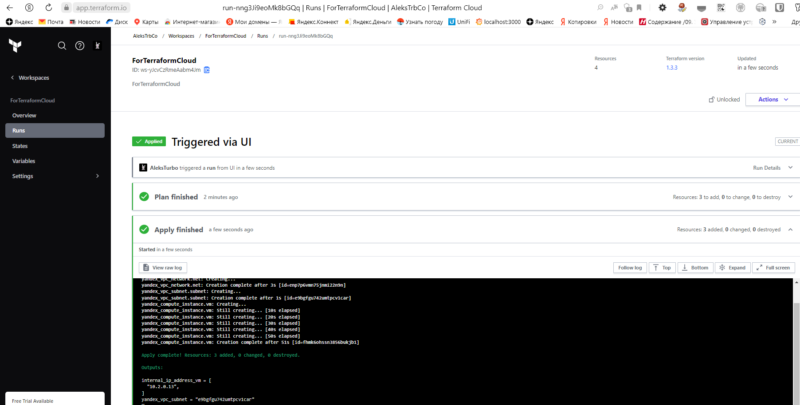
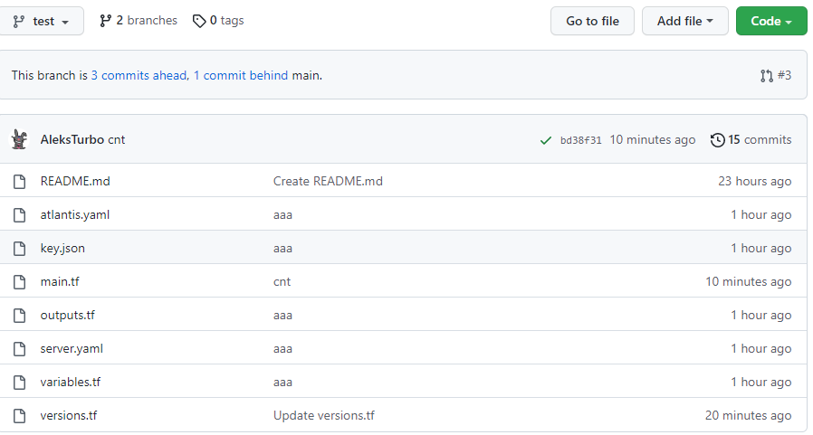
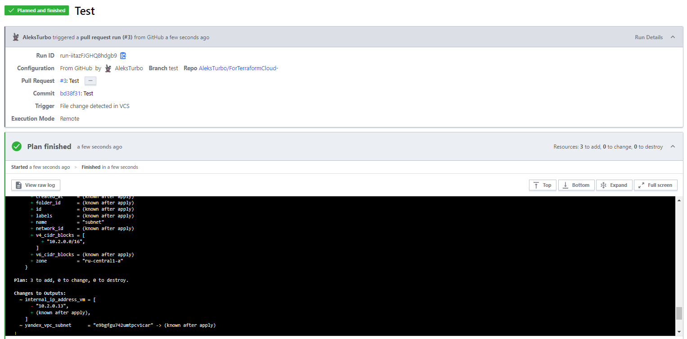

# Домашнее задание к занятию "7.3. Основы и принцип работы Терраформ"

## Задача 1 - Работаем с  terraform cloud:

1. Зарегистрируемся на https://app.terraform.io/ - выполнено
2. Создаем вспомогательный репозиторий: [Files For TerraformCloud](https://github.com/AleksTurbo/ForTerraformCloud-)
3. Подключили репозиторий в terraform.io - готово.
4. Выполняем plan и apply:
  

## Задача 2 - Работаем с ATLANTIS

1. Подготавливаем конфигурационные файлы:
  [server.yaml](https://github.com/AleksTurbo/ForTerraformCloud-/blob/test/server.yaml)
  [atlantis.yaml](https://github.com/AleksTurbo/ForTerraformCloud-/blob/test/atlantis.yaml)
  
2. Проверяем функциональность:
  

## Задача 3 - Знакомство с каталогом модулей.

1. Модуль terraform для  yandex-cloud (v. 0.81.0) - <https://registry.terraform.io/providers/yandex-cloud/yandex/0.81.0>