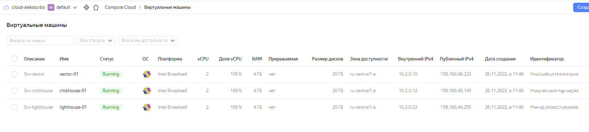

# Домашнее задание к занятию "Ansible 8.3. Использование Yandex Cloud"

## Подготовка к выполнению

1. Подготовим в Yandex Cloud три хоста:



[terraform files](https://github.com/AleksTurbo/ansible83/blob/main/terraform/main.tf)

## Основная часть

1. Допишем playbook: добавим ещё один play, который устанавливает и настраивает lighthouse: 

```ansible
- name: Install lighthouse
```

2. При создании tasks используем модули: get_url, template, yum, apt:

```ansible
name: Install lighthouse
  hosts: lighthouse
  handlers:
    - name: reload-nginx
      become: true
      command: nginx -s reload
  pre_tasks:
    - name: Lighthouse | install dependencies
      become: true
      ansible.builtin.yum:
        name: git
        state: present
  tasks:
    - name: Lighthouse | Copy from git
      become: true
      git:
        repo: "{{ lighthouse_git }}"
        version: master
        dest: "{{ lighthouse_location_dir }}"
    - name: Lighthouse | Create lighthouse config
      become: true
      template:
        src: lighthouse.conf.j2
        dest: /etc/nginx/conf.d/default.conf
        mode: 0644
      notify: reload-nginx
```

3. Tasks должен: скачать статику lighthouse, установить nginx, настроить его конфиг для открытия lighthouse, запустить webserver. - готово.

4. Приготовим свой inventory файл prod.yml - готово

```yuml
---
clickhouse:
  hosts:
    clickhouse-01:
      ansible_host: 158.160.45.145
  vars:
    ansible_user: cloud-user
vector:
  hosts:
    vector-01:
      ansible_host: 158.160.46.222
  vars:
    ansible_user: cloud-user
lighthouse:
  hosts:
    lighthouse-01:
      ansible_host: 158.160.44.255
  vars:
    ansible_user: cloud-user
```

5. Запустим ansible-lint site.yml: остались незначительные

```bash
aleksturbo@AlksTrbNoute:~/ansible83$ ansible-lint site.yml
WARNING  Overriding detected file kind 'yaml' with 'playbook' for given positional argument: site.yml
WARNING  Listing 3 violation(s) that are fatal
yaml: wrong indentation: expected 8 but found 6 (indentation)
site.yml:68

yaml: wrong indentation: expected 8 but found 6 (indentation)
site.yml:75

yaml: line too long (164 > 160 characters) (line-length)
site.yml:127

You can skip specific rules or tags by adding them to your configuration file:
# .ansible-lint
warn_list:  # or 'skip_list' to silence them completely
  - yaml  # Violations reported by yamllint

Finished with 3 failure(s), 0 warning(s) on 1 files.
```

6. Попробуем запустить playbook на этом окружении с флагом --check

```bash
aleksturbo@AlksTrbNoute:~/ansible83$ ansible-playbook -i ./inventory/prod.yml site.yml --check

PLAY [Install Nginx] ***********************************************************************************************************************************************************************************************************

TASK [Gathering Facts] *********************************************************************************************************************************************************************************************************
The authenticity of host '158.160.44.228 (158.160.44.228)' can't be established.
ED25519 key fingerprint is SHA256:swyTq6KSdkm6+X2GE5eQKOs6Pjqd6LTV9VZXa5CVaO0.
This host key is known by the following other names/addresses:
    ~/.ssh/known_hosts:36: [hashed name]
Are you sure you want to continue connecting (yes/no/[fingerprint])? yes
ok: [lighthouse-01]

TASK [NGINX | Install epel-release] ********************************************************************************************************************************************************************************************
ok: [lighthouse-01]

TASK [NGINX | Install NGINX] ***************************************************************************************************************************************************************************************************
ok: [lighthouse-01]

TASK [NGINX | Create general config] *******************************************************************************************************************************************************************************************
ok: [lighthouse-01]

PLAY [Install lighthouse] ******************************************************************************************************************************************************************************************************

TASK [Gathering Facts] *********************************************************************************************************************************************************************************************************
ok: [lighthouse-01]

TASK [Lighthouse | install dependencies] ***************************************************************************************************************************************************************************************
ok: [lighthouse-01]

TASK [Lighthouse | Copy from git] **********************************************************************************************************************************************************************************************
ok: [lighthouse-01]

TASK [Lighthouse | Create lighthouse config] ***********************************************************************************************************************************************************************************
ok: [lighthouse-01]

PLAY [Install Clickhouse] ******************************************************************************************************************************************************************************************************

TASK [Gathering Facts] *********************************************************************************************************************************************************************************************************
The authenticity of host '158.160.41.130 (158.160.41.130)' can't be established.
ED25519 key fingerprint is SHA256:48M3nVoG34NxLD27utaAC9Rx3Jc7BmNQcUHX5b95TSY.
This host key is known by the following other names/addresses:
    ~/.ssh/known_hosts:39: [hashed name]
Are you sure you want to continue connecting (yes/no/[fingerprint])? yes
ok: [clickhouse-01]

TASK [Get clickhouse ['clickhouse-client', 'clickhouse-server', 'clickhouse-common-static'] distrib] ***************************************************************************************************************************
ok: [clickhouse-01] => (item=clickhouse-client)
ok: [clickhouse-01] => (item=clickhouse-server)
failed: [clickhouse-01] (item=clickhouse-common-static) => {"ansible_loop_var": "item", "changed": false, "dest": "./clickhouse-common-static-22.3.3.44.rpm", "elapsed": 0, "gid": 1000, "group": "cloud-user", "item": "clickhouse-common-static", "mode": "0664", "msg": "Request failed", "owner": "cloud-user", "response": "HTTP Error 404: Not Found", "secontext": "unconfined_u:object_r:user_home_t:s0", "size": 246310036, "state": "file", "status_code": 404, "uid": 1000, "url": "https://packages.clickhouse.com/rpm/stable/clickhouse-common-static-22.3.3.44.noarch.rpm"}

TASK [Get clickhouse  ['clickhouse-common-static'] distrib] ********************************************************************************************************************************************************************
ok: [clickhouse-01] => (item=clickhouse-common-static)

TASK [Install clickhouse packages] *********************************************************************************************************************************************************************************************
ok: [clickhouse-01]

TASK [Flush handlers] **********************************************************************************************************************************************************************************************************

TASK [Clickhouse | Config] *****************************************************************************************************************************************************************************************************
ok: [clickhouse-01]

TASK [pause for 10 second(s)] **************************************************************************************************************************************************************************************************
Pausing for 10 seconds
(ctrl+C then 'C' = continue early, ctrl+C then 'A' = abort)
ok: [clickhouse-01]

TASK [Drop exist clickhouse database] ******************************************************************************************************************************************************************************************
skipping: [clickhouse-01]

TASK [Clickhouse | Create database] ********************************************************************************************************************************************************************************************
skipping: [clickhouse-01]

TASK [Clickhouse | Create log table] *******************************************************************************************************************************************************************************************
skipping: [clickhouse-01]

PLAY [Install Vector] **********************************************************************************************************************************************************************************************************

TASK [Gathering Facts] *********************************************************************************************************************************************************************************************************
The authenticity of host '158.160.45.86 (158.160.45.86)' can't be established.
ED25519 key fingerprint is SHA256:tIGZ+v9+DMjfmAuCifjCz+4Ne67zCDstJkTfvPabdbc.
This host key is known by the following other names/addresses:
    ~/.ssh/known_hosts:33: [hashed name]
Are you sure you want to continue connecting (yes/no/[fingerprint])? yes
ok: [vector-01]

TASK [Vector | install rpm] ****************************************************************************************************************************************************************************************************
ok: [vector-01]

TASK [Vector | Template config] ************************************************************************************************************************************************************************************************
changed: [vector-01]

TASK [Vector | create systemd unit] ********************************************************************************************************************************************************************************************
ok: [vector-01]

TASK [Configure VECTOR Service | Template systemd unit] ************************************************************************************************************************************************************************
ok: [vector-01]

TASK [Vector | Start service] **************************************************************************************************************************************************************************************************
changed: [vector-01]

PLAY RECAP *********************************************************************************************************************************************************************************************************************
clickhouse-01              : ok=5    changed=0    unreachable=0    failed=0    skipped=3    rescued=1    ignored=0   
lighthouse-01              : ok=8    changed=0    unreachable=0    failed=0    skipped=0    rescued=0    ignored=0   
vector-01                  : ok=6    changed=2    unreachable=0    failed=0    skipped=0    rescued=0    ignored=0  
```

7. Запустим playbook на prod.yml окружении с флагом --diff

```bash

```

7. Повторно запустим playbook с флагом --diff и убедимся, что playbook идемпотентен:

```bash
aleksturbo@AlksTrbNoute:~/ansible83$ ansible-playbook -i ./inventory/prod.yml site.yml --diff

PLAY [Install Nginx] ***********************************************************************************************************************************************************************************************************

TASK [Gathering Facts] *********************************************************************************************************************************************************************************************************
ok: [lighthouse-01]

TASK [NGINX | Install epel-release] ********************************************************************************************************************************************************************************************
ok: [lighthouse-01]

TASK [NGINX | Install NGINX] ***************************************************************************************************************************************************************************************************
ok: [lighthouse-01]

TASK [NGINX | Create general config] *******************************************************************************************************************************************************************************************
ok: [lighthouse-01]

PLAY [Install lighthouse] ******************************************************************************************************************************************************************************************************

TASK [Gathering Facts] *********************************************************************************************************************************************************************************************************
ok: [lighthouse-01]

TASK [Lighthouse | install dependencies] ***************************************************************************************************************************************************************************************
ok: [lighthouse-01]

TASK [Lighthouse | Copy from git] **********************************************************************************************************************************************************************************************
ok: [lighthouse-01]

TASK [Lighthouse | Create lighthouse config] ***********************************************************************************************************************************************************************************
ok: [lighthouse-01]

PLAY [Install Clickhouse] ******************************************************************************************************************************************************************************************************

TASK [Gathering Facts] *********************************************************************************************************************************************************************************************************
ok: [clickhouse-01]

TASK [Get clickhouse ['clickhouse-client', 'clickhouse-server', 'clickhouse-common-static'] distrib] ***************************************************************************************************************************
ok: [clickhouse-01] => (item=clickhouse-client)
ok: [clickhouse-01] => (item=clickhouse-server)
failed: [clickhouse-01] (item=clickhouse-common-static) => {"ansible_loop_var": "item", "changed": false, "dest": "./clickhouse-common-static-22.3.3.44.rpm", "elapsed": 0, "gid": 1000, "group": "cloud-user", "item": "clickhouse-common-static", "mode": "0664", "msg": "Request failed", "owner": "cloud-user", "response": "HTTP Error 404: Not Found", "secontext": "unconfined_u:object_r:user_home_t:s0", "size": 246310036, "state": "file", "status_code": 404, "uid": 1000, "url": "https://packages.clickhouse.com/rpm/stable/clickhouse-common-static-22.3.3.44.noarch.rpm"}

TASK [Get clickhouse  ['clickhouse-common-static'] distrib] ********************************************************************************************************************************************************************
ok: [clickhouse-01] => (item=clickhouse-common-static)

TASK [Install clickhouse packages] *********************************************************************************************************************************************************************************************
ok: [clickhouse-01]

TASK [Flush handlers] **********************************************************************************************************************************************************************************************************

TASK [Clickhouse | Config] *****************************************************************************************************************************************************************************************************
ok: [clickhouse-01]

TASK [pause for 10 second(s)] **************************************************************************************************************************************************************************************************
Pausing for 10 seconds
(ctrl+C then 'C' = continue early, ctrl+C then 'A' = abort)
ok: [clickhouse-01]

TASK [Drop exist clickhouse database] ******************************************************************************************************************************************************************************************
changed: [clickhouse-01]

TASK [Clickhouse | Create database] ********************************************************************************************************************************************************************************************
changed: [clickhouse-01]

TASK [Clickhouse | Create log table] *******************************************************************************************************************************************************************************************
changed: [clickhouse-01]

PLAY [Install Vector] **********************************************************************************************************************************************************************************************************

TASK [Gathering Facts] *********************************************************************************************************************************************************************************************************
ok: [vector-01]

TASK [Vector | install rpm] ****************************************************************************************************************************************************************************************************
ok: [vector-01]

TASK [Vector | Template config] ************************************************************************************************************************************************************************************************
ok: [vector-01]

TASK [Vector | create systemd unit] ********************************************************************************************************************************************************************************************
ok: [vector-01]

TASK [Configure VECTOR Service | Template systemd unit] ************************************************************************************************************************************************************************
ok: [vector-01]

TASK [Vector | Start service] **************************************************************************************************************************************************************************************************
ok: [vector-01]

PLAY RECAP *********************************************************************************************************************************************************************************************************************
clickhouse-01              : ok=8    changed=3    unreachable=0    failed=0    skipped=0    rescued=1    ignored=0   
lighthouse-01              : ok=8    changed=0    unreachable=0    failed=0    skipped=0    rescued=0    ignored=0   
vector-01                  : ok=6    changed=0    unreachable=0    failed=0    skipped=0    rescued=0    ignored=0   

```

9. Документация на playbook:
<https://github.com/AleksTurbo/ansible83>

10. Ссылка на репозиторий: 
<https://github.com/AleksTurbo/ansible83>
